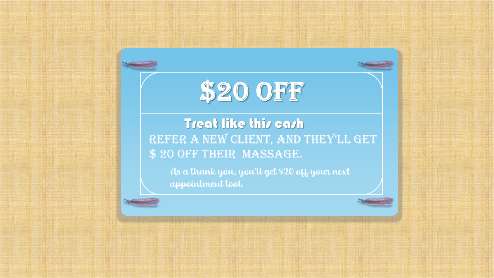
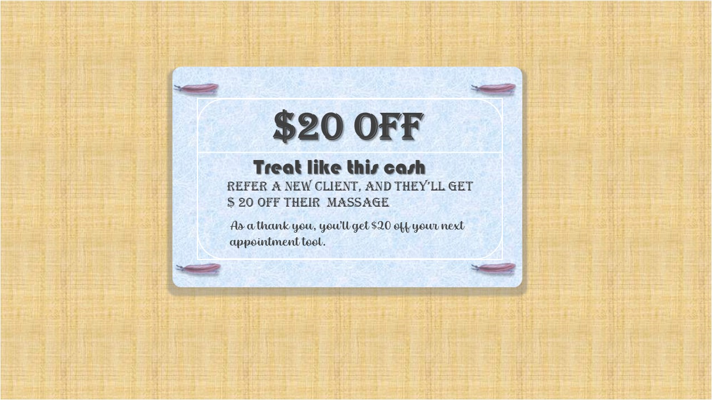
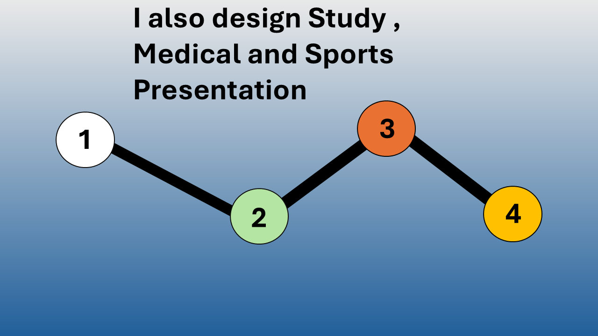
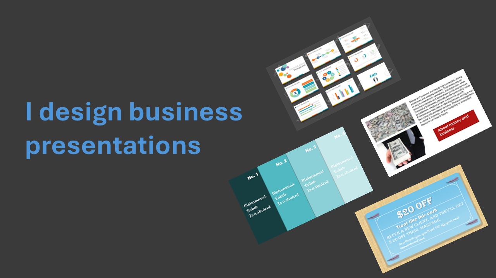
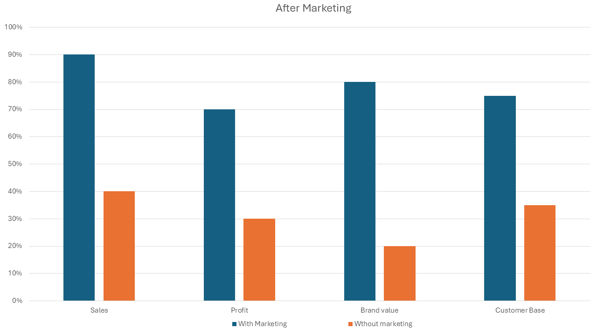
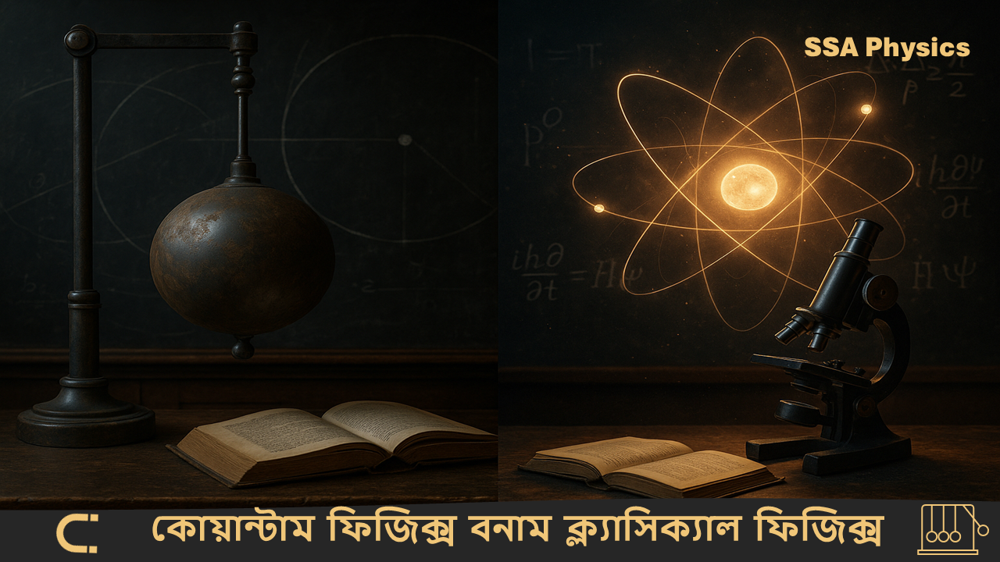
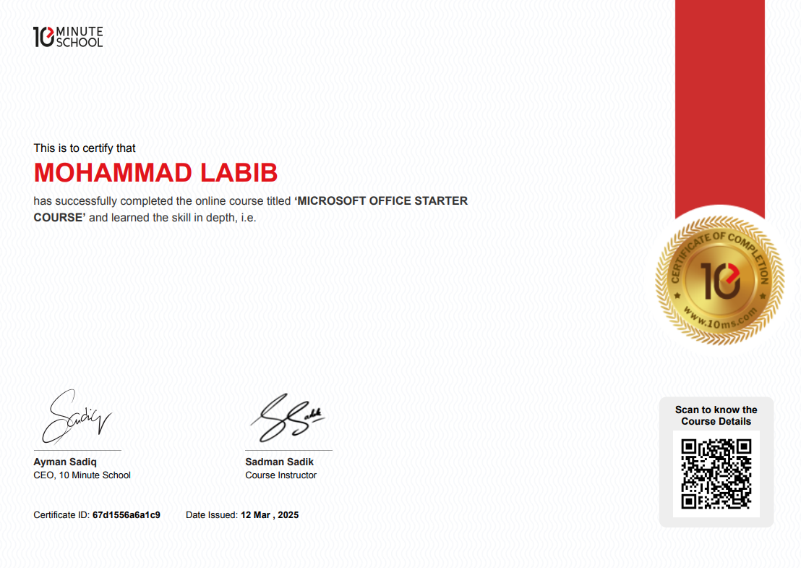
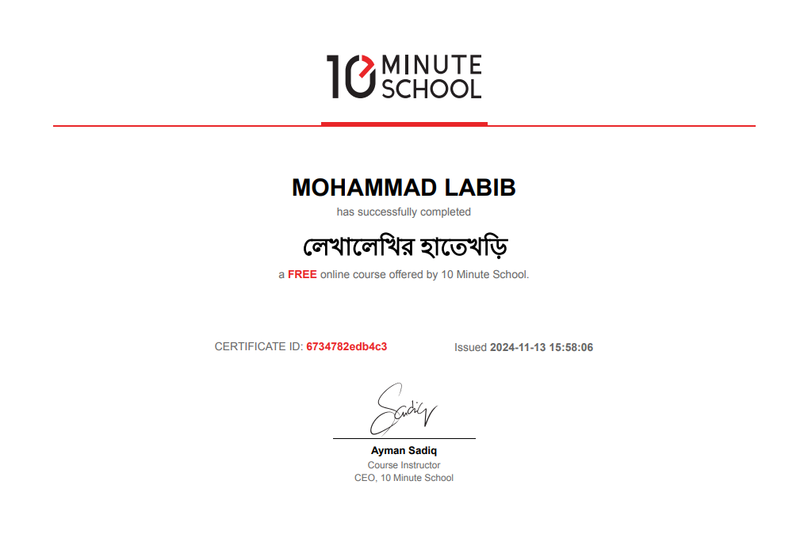

<html> 

    <head>
        <meta name="viewport" content="width=device-width, initial-scale=1.0">
        <link rel="stylesheet" href="style.css">
        <link rel="stylesheet" href="style22.css">
    </head>

    <body>

          

            

             
            
 
            

 
            

            

            
            

            

                    <b> Hey,I am   Mohammod  Labib</b>
            

            

                <b>I am a student and   I am a developer and a designer</b>
            

             

            
            

            

            

            

            

            

            

            

            <a href="https://www.facebook.com/mdlabib.li/" class="fb1">F</a>
            
Web development (coding)

            
Writing

            
Presentation design

            
I am   also a writter

            

                I am a student of inter first year. 
                I am a student of science depertment. 
                But I have some skills for example web development,
                Presentation designing and Script or Story Writing. 
                I always my best to complete a project.
            

            

            

            
<b>Skills</b>

            

            
            
            
            
            
            
            
             
              
               
                
                 

            
<b>Example</b>

            
Presentation slides

             
<b>My certificates</b>

             
             
    </body>

</html>
